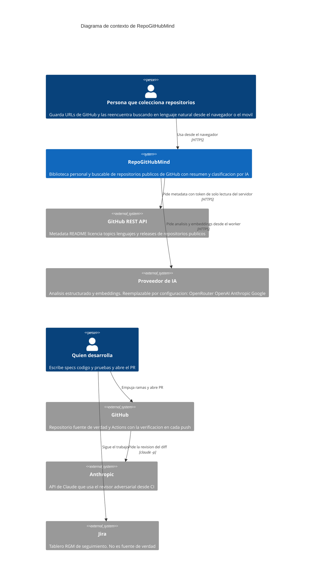
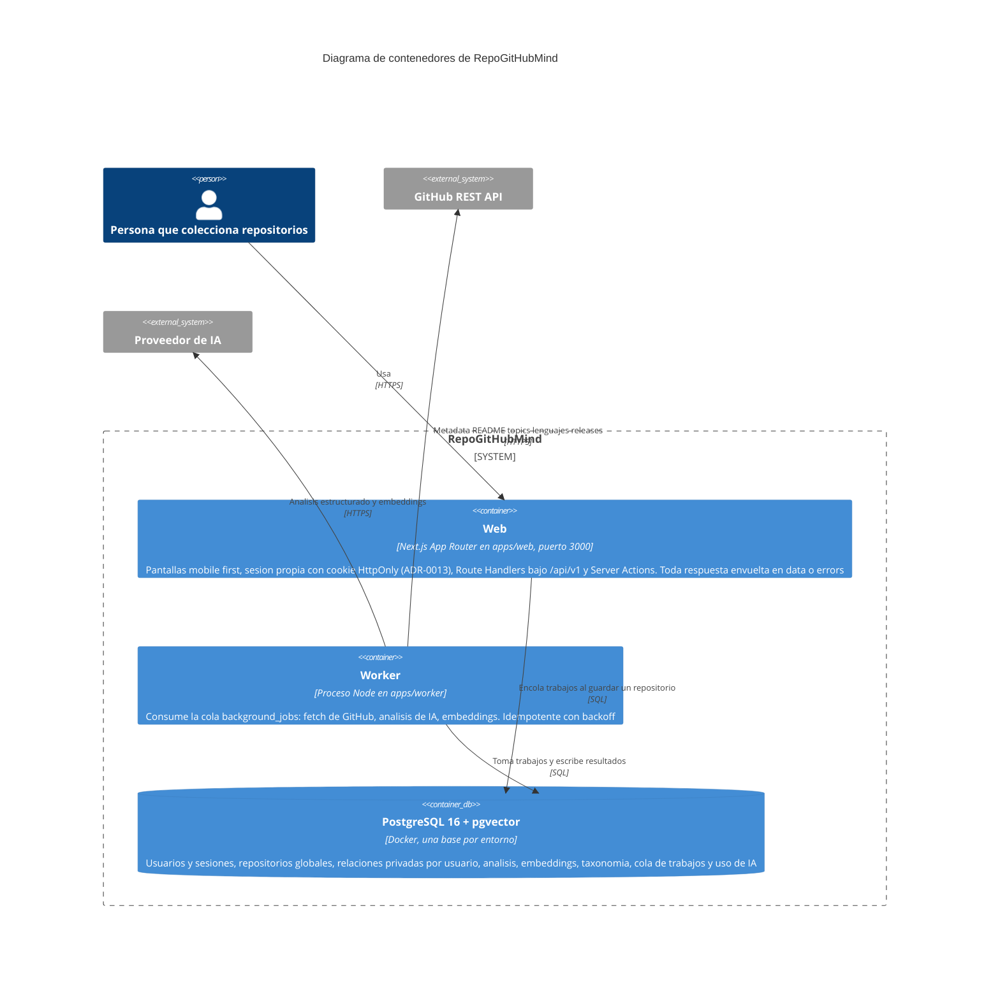
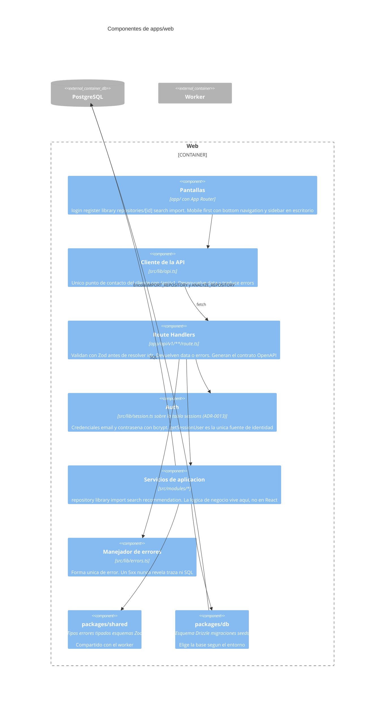
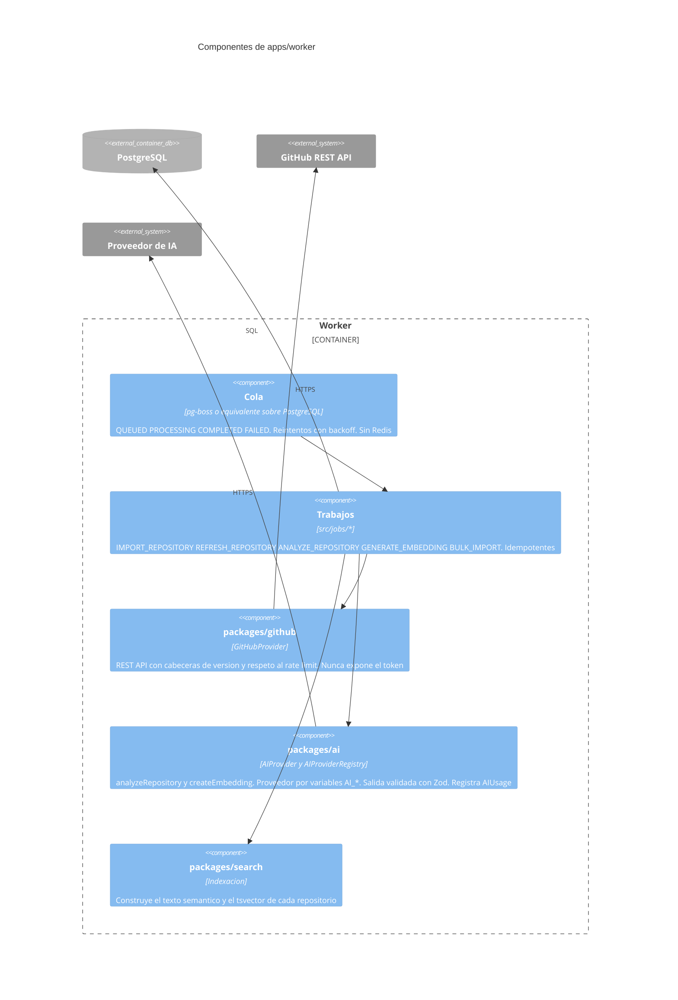
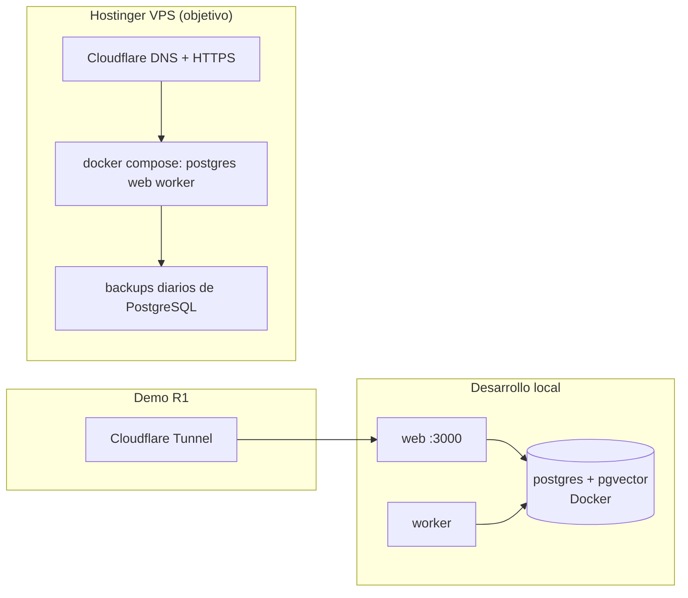

# Arquitectura de RepoGitHubMind

Tres niveles del modelo C4, de fuera hacia dentro: el **contexto** dice con quién habla el sistema, los **contenedores** qué piezas se ejecutan por separado, y los **componentes** qué hay dentro de cada una. Los diagramas son Mermaid dentro de este fichero, así que se versionan y se revisan en el mismo diff que el código que describen.

> **Estado a 2026-09-14:** no hay código todavía ([H-01](hallazgos.md)). Todo lo dibujado es lo decidido en el [prompt maestro](prompts/00-prompt-maestro.md) §44 a §46 y en los ADR; a partir de la Entrega 2, lo que no se pueda verificar leyendo ficheros se quita del dibujo, no al revés.

## Patrón, y por qué

**Monolito modular** ([ADR-0006](adr/0006-monolito-modular.md)): una aplicación Next.js con módulos de dominio bien separados (Auth, Repository, Library, Import, Search, Recommendation, AI, GitHub, Jobs), un worker aparte que consume una cola en PostgreSQL, y **PostgreSQL + pgvector como única infraestructura de datos** ([ADR-0007](adr/0007-postgresql-y-pgvector.md)): datos relacionales, texto completo, vectores y cola de trabajos en el mismo motor.

Lo que aporta: una sola cosa que desplegar y respaldar, un solo `docker compose`, coste de un VPS, y módulos que pueden convertirse en servicios el día que una métrica real lo pida. Lo que sacrifica: el worker y la web comparten base y versión de esquema, así que se despliegan juntos; y la búsqueda vectorial en PostgreSQL rinde peor que una vector DB dedicada por encima de cientos de miles de repositorios, que no es el volumen del MVP.

Dentro de la aplicación, la lógica de negocio no vive en componentes React ni en Route Handlers: `UI → servicios de aplicación → dominio → infraestructura` (§79), sin la ceremonia de una Clean Architecture completa.

## Diagrama de contexto

El sistema en ejecución y su ciclo de desarrollo se dibujan juntos pero fallan de forma distinta: si GitHub Actions o Anthropic no responden, el producto sigue funcionando y lo que se para es la verificación. Si la REST API de GitHub o el proveedor de IA no responden, se puede seguir entrando, viendo y buscando; lo que se para es guardar repositorios nuevos y analizarlos.



## Diagrama de contenedores



**Por qué el worker es un proceso aparte y no una ruta de Next.js**: el análisis de IA tarda decenas de segundos y guardar un repositorio no puede esperar (§68). El worker vive en el mismo monorepo y en la misma imagen base; en desarrollo puede correr fuera de Docker.

## Diagramas de componentes

### Dentro de la web

Las flechas son dependencias leídas de los imports una vez exista el código, no llamadas en tiempo de ejecución.



### Dentro del worker



## Estructura de ficheros

```text
RepoGitHubMind/
  apps/
    web/            Next.js: app/, src/modules/, src/lib/, e2e/, tests/
    worker/         Proceso Node: src/jobs/, src/index.ts, tests/
  packages/
    db/             Esquema Drizzle, migraciones, seeds, cliente que elige la base por entorno
    github/         GitHubProvider
    ai/             AIProvider, AIProviderRegistry, prompts, esquemas de salida
    search/         Texto semántico, tsvector, RRF
    shared/         Tipos, errores tipados, esquemas Zod, normalizador de URL
    config/         eslint, prettier, tsconfig compartidos
  docker/           docker-compose.yml: postgres (pgvector), web, worker
  docs/             Este directorio
  scripts/          Lo que CI ejecuta: verificador, mutaciones, hooks
  .github/          Workflows de verificación y revisión adversarial
  .githooks/        pre-commit y commit-msg
```

pnpm workspaces sin Turborepo mientras no haga falta (§45).

## Infraestructura y despliegue



Primera etapa: localhost expuesto por Cloudflare Tunnel sin abrir puertos ([`deployment-local.md`](deployment-local.md)). Objetivo: un VPS Ubuntu con Docker Compose, Cloudflare delante y backups diarios ([`deployment-hostinger.md`](deployment-hostinger.md)). Nada depende de Vercel ni de Cloudflare Workers.

## Seguridad

Lo que se comprueba y cómo, en [`SECURITY.md`](../SECURITY.md). Las tres decisiones que más pesan sobre el dibujo: la identidad sale siempre de la sesión en el servidor; los tokens de GitHub y de IA solo los tiene el worker y los Route Handlers, nunca el cliente; y ningún error devuelve traza ni SQL ([ADR-0004](adr/0004-el-volcado-de-depuracion-va-apagado.md)).

## Decisiones que explican esta forma

| Decisión                                         | ADR                                                                         |
| ------------------------------------------------ | --------------------------------------------------------------------------- |
| Monolito modular con worker aparte               | [0006](adr/0006-monolito-modular.md)                                        |
| PostgreSQL + pgvector para todo                  | [0007](adr/0007-postgresql-y-pgvector.md)                                   |
| `Repository` global y `UserRepository` privada   | [0008](adr/0008-repository-global-y-userrepository-privada.md)              |
| Proveedor de IA reemplazable y análisis cacheado | [0009](adr/0009-proveedor-de-ia-reemplazable.md)                            |
| Cola de trabajos en PostgreSQL                   | [0010](adr/0010-cola-de-trabajos-en-postgresql.md)                          |
| Contrato generado desde Zod y vigilado           | [0001](adr/0001-el-contrato-se-genera-se-versiona-y-se-vigila-la-deriva.md) |
| Dos repositorios y `git subtree`                 | [0012](adr/0012-dos-repositorios-y-subtree.md)                              |
