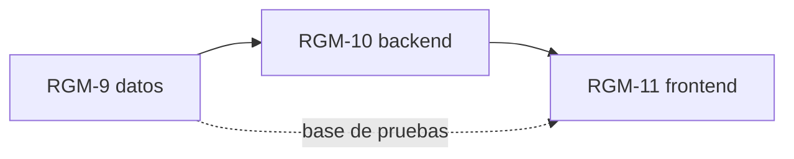

# RGM-2 · H1 · Cuentas y sesión

**Identificador:** `RGM-2` · [en Jira](https://ai4devs.atlassian.net/browse/RGM-2)
**Épica:** RGM-1 · Guardar y reencontrar repositorios de GitHub
**Traza:** RF-1, RF-2, RF-3 del [PRD](../prd.md) · Prompt maestro §54 Accounts, §41
**Prioridad:** must-have · **Entrega:** 2 · **Spec:** [`specs/auth`](../specs/auth/spec.md)

## Historia

> Como persona que colecciona repositorios, quiero crear una cuenta con email y contraseña, entrar, salir y que mi sesión sobreviva a recargar, para que mi biblioteca sea mía y nadie más la vea.

> **Nota de estado.** Los criterios marcados **[PROPUESTO]** no derivan del PRD: cubren huecos detectados al redactarlos, y se validan antes de escribir pruebas contra ellos.

## Criterios de aceptación

### Camino feliz

**CA-1 · Registro directo a la biblioteca**
DADO que no tengo cuenta
CUANDO me registro con email, contraseña y confirmación válidos
ENTONCES entro directo a mi biblioteca vacía, sin pasar por la pantalla de acceso.

**CA-2 · Entrar y salir**
DADO que tengo cuenta
CUANDO entro con credenciales correctas y después salgo
ENTONCES veo mi biblioteca al entrar, y al salir la sesión deja de valer.

**CA-3 · La sesión sobrevive a recargar**
DADO que tengo sesión
CUANDO recargo la aplicación
ENTONCES sigo dentro sin volver a introducir credenciales.

### Lo que no debe ocurrir

**CA-4 · Un email, una cuenta, ignorando mayúsculas**
DADO que `ada@example.com` existe
CUANDO intento registrarme como `Ada@Example.com`
ENTONCES se rechaza sobre el campo email y sigue habiendo una sola cuenta.

**CA-5 · Un fallo no revela si la cuenta existe**
DADO un email desconocido, y por separado un email conocido con contraseña equivocada
CUANDO intento entrar
ENTONCES las dos respuestas son idénticas.

**CA-6 · Sin sesión no hay datos**
DADO cualquier ruta privada
CUANDO la pido sin sesión, o con una cookie inventada o revocada
ENTONCES recibo `401` y no se devuelve ningún dato.

### Errores y límites

**CA-7 · Errores por campo y todos a la vez**
DADO el formulario de registro
CUANDO envío varios campos mal a la vez
ENTONCES veo un error junto a cada campo, en castellano, sin perder lo escrito.

**CA-8 · Demasiados intentos** · **[PROPUESTO]**
DADO la misma dirección
CUANDO supera el límite de intentos de acceso en la ventana
ENTONCES recibe `429` y no se evalúan más intentos hasta que pase.

_Motivo: el PRD pide rate limiting como no funcional (§7) sin decir dónde; el registro y el acceso expuestos a Internet por el túnel son el primer sitio._

**CA-9 · El servidor no está disponible al arrancar** · **[PROPUESTO]**
DADO que tengo sesión guardada
CUANDO la aplicación arranca y el servidor no responde
ENTONCES se avisa, se conserva la sesión, y al recuperar el servidor sigo dentro.

_Motivo: en el proyecto de origen del harness un fallo de red al arrancar borraba el token guardado (H-38 allí). Se escribe para no repetirlo._

## Fuera de alcance

- GitHub OAuth y Google (R2, [`roadmap.md`](../roadmap.md)).
- Recuperación de contraseña por email.
- Rol ADMIN con interfaz (roadmap): el campo `role` existe desde el esquema, la interfaz no.

## Tickets

Cada ticket hereda los criterios de arriba; su Definition of Done es cómo entregamos. Uno por capa, como pide la sección 6 del readme de LIDR.

### RGM-9 · H1.1 · Base de datos: esquema de cuentas y sesiones, migración inicial y base de pruebas aislada

**Capa:** datos · **Talla:** M · [en Jira](https://ai4devs.atlassian.net/browse/RGM-9)

**Qué se hace.** `packages/db` con el esquema Drizzle de `users`, `accounts`, `sessions`, `verification_tokens`: `email` único ignorando mayúsculas (índice sobre `lower(email)`), `password_hash`, `role`, fechas. Primera migración con `drizzle-kit` y `pnpm db:migrate`; la extensión `vector` habilitada en la misma migración. `docker/docker-compose.yml` con `postgres` (pgvector) y las dos bases. `.env.example` y `.env.test`. Seed con el usuario de desarrollo y contraseña de ejemplo.

**Definition of Done**

- [x] Migración aplicada desde cero en un contenedor limpio; `pnpm db:migrate` idempotente (`packages/db/migrations/0000_medical_patch.sql`, aplicada a las dos bases el 2026-09-14)
- [x] Prueba que pregunta a la conexión viva por `current_database()` y asserta `repogithubmind_test` (`packages/db/tests/aislamiento.test.ts`)
- [x] Comprobación en `verificar-docs.mjs` de que el cliente elige la base por entorno, con su entrada `ADR-0003` en `mutaciones.mjs` vista morder
- [x] `docs/data-model.md` con las columnas reales; fila en `docs/traceability.md`
- [x] Dependencias `drizzle-orm`, `drizzle-kit`, `postgres`, `bcryptjs`, `dotenv`, `tsx` comprobadas en npm y declaradas en el PR

### RGM-10 · H1.2 · Backend: registro con Zod, Auth.js con credenciales, sesión desde el servidor y forma única de error

**Capa:** backend · **Talla:** L · [en Jira](https://ai4devs.atlassian.net/browse/RGM-10)

**Qué se hace.** `POST /api/v1/auth/register` con Zod, email en minúsculas, hash con `bcryptjs`, `201 { data }` y sesión abierta. Sesión propia con token opaco en `sessions` y cookie `rgm_session` en vez de Auth.js mientras solo haya credenciales ([ADR-0013](../adr/0013-sesion-propia-en-vez-de-authjs.md)). `getSessionUser(req)` en `apps/web/src/lib/session.ts` como única fuente de identidad. Manejador de errores único ([ADR-0004](../adr/0004-el-volcado-de-depuracion-va-apagado.md)). Contrato desde Zod con `zod-to-openapi` ([ADR-0001](../adr/0001-el-contrato-se-genera-se-versiona-y-se-vigila-la-deriva.md)). Rate limiting en registro y acceso.

**Definition of Done**

- [x] Una prueba de integración por escenario de `specs/auth`, citando el requisito en la cabecera (`apps/web/tests/auth.test.ts`, 12 casos)
- [x] Prueba que provoca un `500` real y comprueba que el cuerpo no contiene el mensaje ni SQL (`apps/web/tests/errores.test.ts`; mutación `ADR-0004`)
- [x] `pnpm openapi:check` en verde con el contrato regenerado; tabla de rutas de `CLAUDE.md` al día
- [x] Número de pruebas actualizado en `CLAUDE.md`, total y desglose
- [x] Prueba del `429` por intentos
- [x] Dependencias comprobadas en npm y declaradas en el PR (`zod`, `@asteasolutions/zod-to-openapi`, `bcryptjs`)

### RGM-11 · H1.3 · Frontend: pantallas de registro y acceso, guards de rutas y flujo E2E

**Capa:** frontend · **Talla:** M · [en Jira](https://ai4devs.atlassian.net/browse/RGM-11)

**Qué se hace.** `/register` y `/login` con componentes de `components/ui/` (a mano hasta [H-04](../hallazgos.md)) y los esquemas Zod de `packages/shared`, errores por campo en castellano, estado de envío, mobile first, dark/light/system. Guards de rutas privadas y públicas. `apps/web/src/lib/api.ts` como único punto de contacto. Playwright en `apps/web/e2e/` con `flujo.e2e.ts`: registro, biblioteca vacía, salir, entrar.

**Definition of Done**

- [x] Vitest sobre `lib/api.ts`: desenvolver, traducir errores, aviso de `401` (`apps/web/src/lib/api.test.ts`, 5 casos)
- [x] `flujo.e2e.ts` en verde en local a escritorio y a 375 px. En el catálogo entra con H3 como `flujo-principal`, cuando el job de mutaciones tenga PostgreSQL y Chromium
- [x] Sin `any`; lint, typecheck y format en verde
- [x] Capturas de las dos pantallas en `docs/evidencia/` para la sección 1.3 del readme de LIDR
- [ ] `components/ui/` traídos con `shadcn add`, no editados a mano · deuda [H-04](../hallazgos.md), cierra con RGM-4

### Orden de implementación

1. RGM-9 (sin él no se cierra nada: la base de pruebas se paga aquí una vez)
2. RGM-10
3. RGM-11

### Grafo de dependencias

