# Modelo de datos de RepoGitHubMind

> Derivado del [prompt maestro](prompts/00-prompt-maestro.md) §3, §13, §14, §38 y §69. Describe el esquema de `packages/db/src/schema.ts` y sus migraciones `0000` a `0002` (H1, H2 y H4), que es lo que manda; `search_vector` y `repository_embeddings` son todavía diseño y llegan con H5.

## La separación que lo organiza todo

**`repositories` es global**: un repositorio público de GitHub existe una sola vez aunque lo guarden diez mil cuentas. Contiene solo información pública y los resultados de IA, que se comparten. **`user_repositories` es privada**: representa que una cuenta guardó ese repositorio, con su estado, favorito, rating y notas. Ningún dato de esa tabla sale a otra cuenta ([ADR-0008](adr/0008-repository-global-y-userrepository-privada.md)).

## Entidades

```mermaid
erDiagram
    users ||--o{ user_repositories : "guarda"
    users ||--o{ accounts : "tiene"
    users ||--o{ sessions : "abre"
    repositories ||--o{ user_repositories : "guardado por"
    repositories ||--o| repository_analyses : "analizado como"
    repositories ||--o| repository_embeddings : "vectorizado como"
    repositories ||--o{ repository_categories : "clasificado en"
    categories ||--o{ repository_categories : ""
    categories ||--o{ categories : "padre de"
    repositories ||--o{ repository_tags : "etiquetado"
    tags ||--o{ repository_tags : ""
    repositories ||--o{ ai_usage : "coste de"
    repositories ||--o{ background_jobs : "trabajo sobre"

    users {
        uuid id PK
        text email UK "unico ignorando mayusculas"
        text password_hash
        text role "USER | ADMIN"
        timestamptz created_at
        timestamptz updated_at
    }
    accounts {
        uuid id PK
        uuid user_id FK
        text provider "github y google en R2; vacia en R1"
        text provider_account_id
        timestamptz created_at
    }
    sessions {
        text token PK "opaco, 32 bytes aleatorios"
        uuid user_id FK
        timestamptz expires_at
        timestamptz created_at
    }
    repositories {
        uuid id PK
        bigint github_repository_id UK "identificador externo estable"
        text full_name UK "owner/name en minusculas"
        text owner
        text name
        text url
        text description
        text homepage
        text primary_language
        text license "SPDX o null"
        text[] topics
        jsonb languages "nombre -> bytes"
        int stars
        int forks
        int open_issues
        boolean archived
        boolean fork
        text default_branch
        text readme "truncado a AI_MAX_README_CHARS"
        text latest_release
        timestamptz github_created_at
        timestamptz github_updated_at
        timestamptz github_pushed_at "base de ultima actividad"
        timestamptz latest_release_at
        timestamptz metadata_refreshed_at
        tsvector search_vector "generado: nombre descripcion topics resumen"
        timestamptz created_at
        timestamptz updated_at
    }
    repository_analyses {
        uuid id PK
        uuid repository_id FK
        text status "PENDING | COMPLETED | FAILED | DISABLED"
        text summary "max 200"
        text purpose
        text[] main_use_cases "max 5"
        text installation_summary
        text[] deployment_type
        text[] frameworks
        text maturity
        text[] advantages "max 3"
        text[] limitations "max 3"
        text[] target_users
        text activity_assessment
        text abandonment_risk "LOW | MEDIUM | HIGH | UNKNOWN, el de la IA"
        real ai_confidence "no sale por la API"
        text provider
        text model
        text last_error
        timestamptz ai_analyzed_at
        timestamptz expires_at "TTL"
        timestamptz created_at
        timestamptz updated_at
    }
    repository_embeddings {
        uuid repository_id PK
        vector embedding "1536, PA-3"
        text model
        text source_hash "hash del texto vectorizado para no recalcular"
        timestamptz created_at
    }
    user_repositories {
        uuid id PK
        uuid user_id FK
        uuid repository_id FK
        text status "NEW ... ARCHIVED"
        boolean favorite
        smallint rating "1..5 o null"
        text notes "max 4000"
        text source
        text source_text
        text custom_title
        timestamptz saved_at
        timestamptz reviewed_at
        timestamptz updated_at
    }
    categories {
        uuid id PK
        uuid parent_id FK
        text slug UK
        text name
        text path UK "artificial-intelligence/agents/agent-memory"
        int depth
        text[] synonyms "para el mapeo de la IA"
        timestamptz created_at
    }
    repository_categories {
        uuid repository_id PK "y FK"
        uuid category_id PK "y FK"
        text origin "AI | ADMIN"
        real confidence
        timestamptz created_at
    }
    tags {
        uuid id PK
        text slug "unico con kind"
        text kind "AI | GITHUB_TOPIC"
        timestamptz created_at
    }
    repository_tags {
        uuid repository_id PK "y FK"
        uuid tag_id PK "y FK"
    }
    ai_usage {
        uuid id PK
        uuid repository_id FK "set null al borrar el repositorio"
        text provider
        text model
        text operation "ANALYSIS | EMBEDDING"
        int input_tokens
        int output_tokens
        numeric estimated_cost "el que declara el proveedor, o null"
        boolean success
        text error "de la llamada que falla o no valida"
        text[] unmapped_categories "sugerencias fuera del catalogo"
        timestamptz created_at
    }
    background_jobs {
        uuid id PK
        text type "IMPORT_REPOSITORY | ANALYZE_REPOSITORY | GENERATE_EMBEDDING | REFRESH_REPOSITORY | BULK_IMPORT"
        uuid repository_id FK
        uuid user_id FK
        text status "QUEUED | PROCESSING | COMPLETED | FAILED"
        jsonb payload
        int attempts
        text last_error
        timestamptz run_after
        timestamptz created_at
        timestamptz updated_at
    }
```

`sessions` guarda las sesiones propias de R1 ([ADR-0013](adr/0013-sesion-propia-en-vez-de-authjs.md)): cerrar sesión borra la fila. `accounts` y `verification_tokens` (no dibujada) tienen la forma que el adaptador de Drizzle para Auth.js exige y se crean ya para no migrar dos veces cuando entren GitHub OAuth y Google en R2; en R1 están vacías. Columnas reales en `packages/db/src/schema.ts` y en `packages/db/migrations/`. Con H2 existen `repositories`, `repository_analyses`, `user_repositories` y `background_jobs` (migración `0001`); con H4, `categories`, `repository_categories`, `tags`, `repository_tags` y `ai_usage` (migración `0002`), con el catálogo sembrado por `packages/db/src/taxonomy.ts` en todos los entornos; `search_vector` y `repository_embeddings` llegan con H5. Si `pg-boss` resulta la cola elegida ([ADR-0010](adr/0010-cola-de-trabajos-en-postgresql.md)), `background_jobs` la sustituye su propio esquema `pgboss` y aquí queda solo la vista de estados que lee la interfaz.

## Restricciones e índices

| Tabla                   | Restricción o índice                                                                                              | Por qué                                                                                                          |
| ----------------------- | ----------------------------------------------------------------------------------------------------------------- | ---------------------------------------------------------------------------------------------------------------- |
| `users`                 | único sobre `lower(email)`                                                                                        | La misma persona no puede registrarse dos veces con otras mayúsculas                                             |
| `repositories`          | único `github_repository_id`; único `full_name`                                                                   | El id de GitHub es el identificador estable; `full_name` normalizado evita duplicados por variantes de URL (§30) |
| `repositories`          | GIN sobre `search_vector`; índices sobre `github_pushed_at`, `stars`, `primary_language`, `license`               | Búsqueda léxica y filtros de la biblioteca (§69)                                                                 |
| `repository_embeddings` | índice HNSW sobre `embedding` **solo cuando el volumen lo justifique**                                            | Con cientos de repositorios el escaneo secuencial basta; no se optimiza antes (§69)                              |
| `user_repositories`     | único `(user_id, repository_id)`; índices sobre `(user_id, status)`, `(user_id, favorite)`, `(user_id, saved_at)` | Una relación por cuenta y repositorio; los filtros de la biblioteca                                              |
| `repository_analyses`   | único `repository_id`                                                                                             | Un análisis vigente por repositorio; los anteriores se sustituyen, no se acumulan                                |
| `categories`            | único `slug`; `path` único                                                                                        | Taxonomía controlada con jerarquía (§15)                                                                         |
| `repository_categories` | clave `(repository_id, category_id)`; índice sobre `category_id`                                                  | Una vez por categoría; el filtro por rama busca por categoría                                                    |
| `tags`                  | único `(kind, slug)`                                                                                              | El mismo término puede ser tag de IA y topic de GitHub sin chocar                                                |
| `ai_usage`              | índices sobre `repository_id` y `created_at`                                                                      | Coste por repositorio y por periodo                                                                              |
| `background_jobs`       | índice `(status, run_after)`                                                                                      | El worker toma el siguiente trabajo sin escanear                                                                 |

## Reglas de negocio que viven en el modelo

Las que no se ven en una columna y por eso se documentan. Cada una con su prueba unitaria y su escenario en la spec.

| Regla                                                                                                                                                                                                                                                                                   | Dónde                                  | Prueba                                | Escenario                                             |
| --------------------------------------------------------------------------------------------------------------------------------------------------------------------------------------------------------------------------------------------------------------------------------------- | -------------------------------------- | ------------------------------------- | ----------------------------------------------------- |
| Toda variante de `github.com/owner/repo` (con `/`, `.git`, query, sin protocolo, mayúsculas) normaliza al mismo `full_name` en minúsculas                                                                                                                                               | `packages/shared/src/github-url.ts`    | `github-url.test.ts`                  | `specs/repositories`: «Una URL en cualquier variante» |
| «Última actividad» es `github_pushed_at`, no `github_updated_at`                                                                                                                                                                                                                        | `repositories`                         | `rest.test.ts`                        | `specs/repositories`: «Última actividad»              |
| El análisis se reutiliza salvo `expires_at` pasado, `github_pushed_at` posterior a `ai_analyzed_at`, o forzado                                                                                                                                                                          | `packages/ai/src/cache.ts`             | `cache.test.ts`                       | `specs/ai`: «Un análisis por repositorio»             |
| El texto semántico se construye con nombre, descripción, resumen, propósito, casos de uso, categorías, tags y topics, y se vectoriza solo si cambió (`source_hash`)                                                                                                                     | `packages/search/src/semantic-text.ts` | `semantic-text.test.ts`               | `specs/search`: «Qué se vectoriza»                    |
| Riesgo de abandono: `HIGH` si archivado o sin push en 18 meses, `MEDIUM` sin push en 6 meses, `LOW` con push en 6 meses, `UNKNOWN` sin datos. Heurística transparente, nunca presentada como hecho. Se calcula al leer; `abandonment_risk` guarda el de la IA, que solo cubre `UNKNOWN` | `packages/ai/src/heuristics.ts`        | `heuristics.test.ts`                  | `specs/ai`: «Riesgo de abandono»                      |
| Una categoría sugerida por la IA casa con el catálogo por ruta, slug, nombre o sinónimo; lo que no casa es tag de IA y se cuenta en `ai_usage.unmapped_categories`; la IA nunca crea categorías                                                                                         | `packages/ai/src/taxonomy-mapper.ts`   | `taxonomy-mapper.test.ts`             | `specs/ai`: «Categorías del catálogo»                 |
| Toda query sobre `user_repositories` filtra por el `user_id` de la sesión                                                                                                                                                                                                               | `apps/web/src/modules/library`         | prueba de integración con dos cuentas | `specs/library`: «Lo mío no lo ve nadie»              |

## Lo que no se guarda, a propósito

- El código del repositorio ni su árbol de ficheros (R3).
- El archivo `.txt` de importación: se procesa, se extraen las URLs y se descarta (§6).
- Quién más guardó un repositorio: solo se podrán mostrar agregados anónimos, y no en esta vertical (§4).
- Snapshots históricos de metadata: llegan con refresh (§39, roadmap).

## Entornos

| Entorno    | Base                                                                     | Cómo se aísla                                                                                                                                                                                               |
| ---------- | ------------------------------------------------------------------------ | ----------------------------------------------------------------------------------------------------------------------------------------------------------------------------------------------------------- |
| Desarrollo | `repogithubmind` en el `postgres` de `docker/`                           | `DATABASE_URL`                                                                                                                                                                                              |
| Pruebas    | `repogithubmind_test` en el mismo contenedor                             | `DATABASE_URL_TEST`, y el runner fuerza `NODE_ENV=test` de forma incondicional: la suite no puede escribir sobre la base de desarrollo ([ADR-0003](adr/0003-aislamiento-de-la-base-de-datos-en-pruebas.md)) |
| Producción | No desplegado. Objetivo: PostgreSQL en el mismo VPS, con backups diarios | [`deployment-hostinger.md`](deployment-hostinger.md)                                                                                                                                                        |

Todas las modificaciones de esquema van por migraciones de Drizzle; nunca SQL manual en producción (§82). Los seeds crean la taxonomía, un usuario de desarrollo con contraseña de ejemplo y unos repositorios de demostración (§83).
