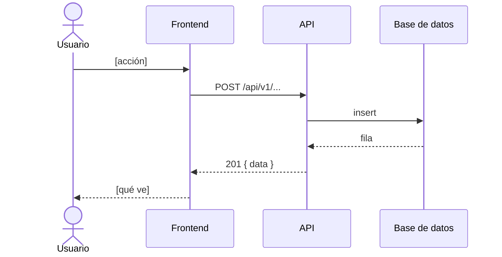

# Diagramas

Los diagramas C4 (contexto, contenedores, componentes) viven **dentro de [`architecture.md`](../architecture.md)** como bloques Mermaid, y el modelo de datos dentro de [`data-model.md`](../data-model.md). Se versionan y se revisan en el mismo diff que el código que describen.

Esta carpeta es para diagramas que no encajan ahí: flujos de secuencia de un caso de uso, máquinas de estado, despliegue. Uno por fichero, en Mermaid, con fecha y con qué fichero de código se leyó para dibujarlo.

## Plantilla

````markdown
# [Qué muestra]

> Leído de `[fichero]` el AAAA-MM-DD. Lo que no se ha podido verificar leyendo ficheros no aparece.


````

```

Sin comas dentro de las etiquetas de C4: Mermaid las interpreta como separador de argumentos.
```
